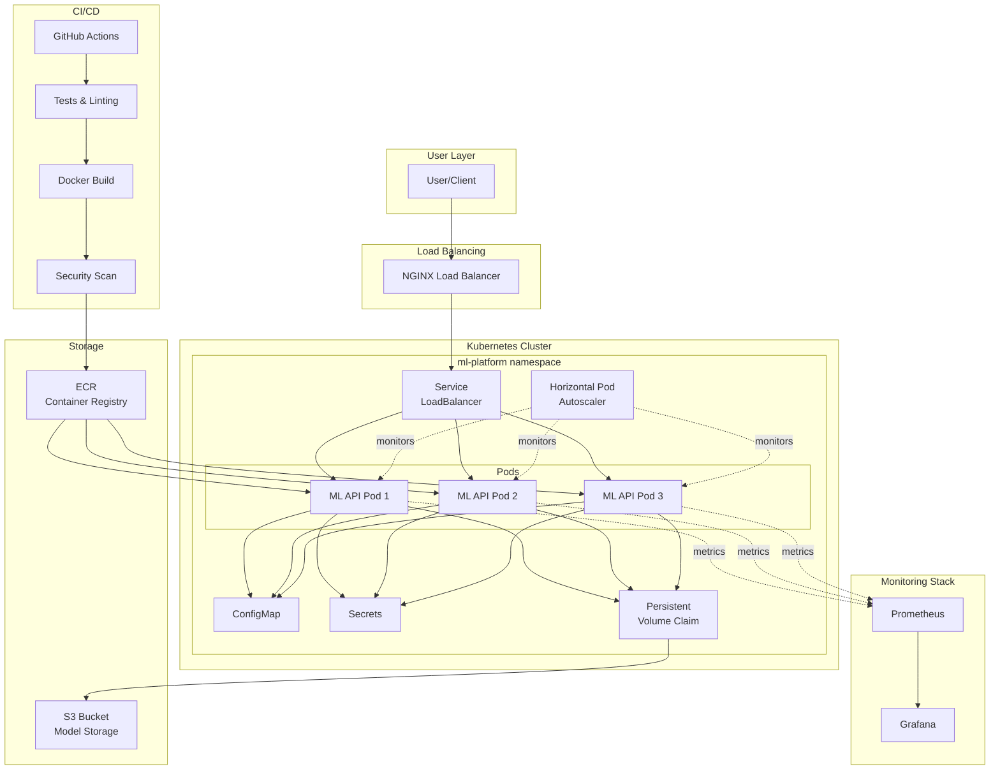
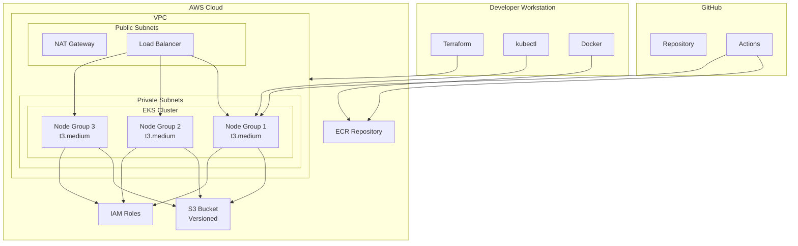
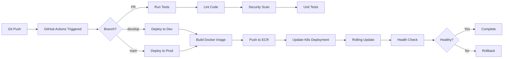
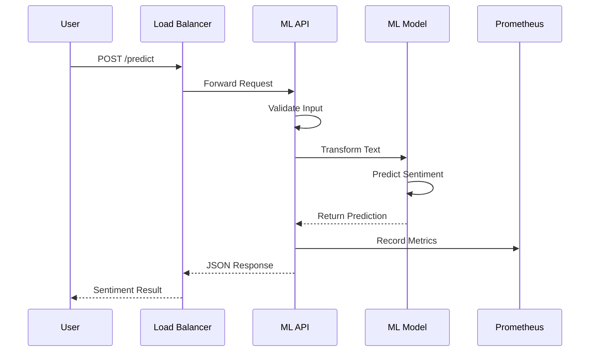

# Architecture Overview

## System Architecture

```mermaid
graph TB
    subgraph "User Layer"
        U[User/Client]
    end
    
    subgraph "Load Balancing"
        LB[NGINX Load Balancer]
    end
    
    subgraph "Kubernetes Cluster"
        subgraph "ml-platform namespace"
            SVC[Service<br/>LoadBalancer]
            HPA[Horizontal Pod<br/>Autoscaler]
            
            subgraph "Pods"
                P1[ML API Pod 1]
                P2[ML API Pod 2]
                P3[ML API Pod 3]
            end
            
            CM[ConfigMap]
            SEC[Secrets]
            PVC[Persistent<br/>Volume Claim]
        end
    end
    
    subgraph "Monitoring Stack"
        PROM[Prometheus]
        GRAF[Grafana]
    end
    
    subgraph "Storage"
        S3[S3 Bucket<br/>Model Storage]
        ECR[ECR<br/>Container Registry]
    end
    
    subgraph "CI/CD"
        GHA[GitHub Actions]
        TEST[Tests & Linting]
        BUILD[Docker Build]
        SCAN[Security Scan]
    end
    
    U --> LB
    LB --> SVC
    SVC --> P1
    SVC --> P2
    SVC --> P3
    
    HPA -.monitors.-> P1
    HPA -.monitors.-> P2
    HPA -.monitors.-> P3
    
    P1 --> CM
    P2 --> CM
    P3 --> CM
    
    P1 --> SEC
    P2 --> SEC
    P3 --> SEC
    
    P1 --> PVC
    P2 --> PVC
    P3 --> PVC
    
    P1 -.metrics.-> PROM
    P2 -.metrics.-> PROM
    P3 -.metrics.-> PROM
    
    PROM --> GRAF
    
    PVC --> S3
    
    GHA --> TEST
    TEST --> BUILD
    BUILD --> SCAN
    SCAN --> ECR
    ECR --> P1
    ECR --> P2
    ECR --> P3
```

## Infrastructure Architecture

```mermaid
graph TB
    subgraph "AWS Cloud"
        subgraph "VPC"
            subgraph "Public Subnets"
                NAT[NAT Gateway]
                LB[Load Balancer]
            end
            
            subgraph "Private Subnets"
                subgraph "EKS Cluster"
                    NG1[Node Group 1<br/>t3.medium]
                    NG2[Node Group 2<br/>t3.medium]
                    NG3[Node Group 3<br/>t3.medium]
                end
            end
        end
        
        ECR[ECR Repository]
        S3[S3 Bucket<br/>Versioned]
        IAM[IAM Roles]
    end
    
    subgraph "Developer Workstation"
        TF[Terraform]
        KUBECTL[kubectl]
        DOCKER[Docker]
    end
    
    subgraph "GitHub"
        REPO[Repository]
        ACTIONS[Actions]
    end
    
    TF --> VPC
    KUBECTL --> NG1
    DOCKER --> ECR
    
    ACTIONS --> ECR
    ACTIONS --> NG1
    
    NG1 --> S3
    NG2 --> S3
    NG3 --> S3
    
    NG1 --> IAM
    NG2 --> IAM
    NG3 --> IAM
    
    LB --> NG1
    LB --> NG2
    LB --> NG3
```

## CI/CD Pipeline Flow

```mermaid
graph LR
    A[Git Push] --> B[GitHub Actions Triggered]
    B --> C{Branch?}
    
    C -->|PR| D[Run Tests]
    C -->|develop| E[Deploy to Dev]
    C -->|main| F[Deploy to Prod]
    
    D --> G[Lint Code]
    G --> H[Security Scan]
    H --> I[Unit Tests]
    
    E --> J[Build Docker Image]
    F --> J
    
    J --> K[Push to ECR]
    K --> L[Update K8s Deployment]
    L --> M[Rolling Update]
    M --> N[Health Check]
    N --> O{Healthy?}
    
    O -->|Yes| P[Complete]
    O -->|No| Q[Rollback]
```

## Request Flow

```mermaid
sequenceDiagram
    participant User
    participant LB as Load Balancer
    participant API as ML API
    participant Model as ML Model
    participant Prom as Prometheus
    
    User->>LB: POST /predict
    LB->>API: Forward Request
    API->>API: Validate Input
    API->>Model: Transform Text
    Model->>Model: Predict Sentiment
    Model-->>API: Return Prediction
    API->>Prom: Record Metrics
    API-->>LB: JSON Response
    LB-->>User: Sentiment Result
```

## Deployment Strategy

```mermaid
graph TB
    subgraph "Rolling Update Process"
        A[Current: 3 Pods v1.0]
        B[Create 1 Pod v2.0]
        C[Wait for Readiness]
        D[Terminate 1 Pod v1.0]
        E[Create 1 Pod v2.0]
        F[Wait for Readiness]
        G[Terminate 1 Pod v1.0]
        H[Create 1 Pod v2.0]
        I[Wait for Readiness]
        J[Terminate Last Pod v1.0]
        K[Complete: 3 Pods v2.0]
    end
    
    A --> B
    B --> C
    C --> D
    D --> E
    E --> F
    F --> G
    G --> H
    H --> I
    I --> J
    J --> K
```
